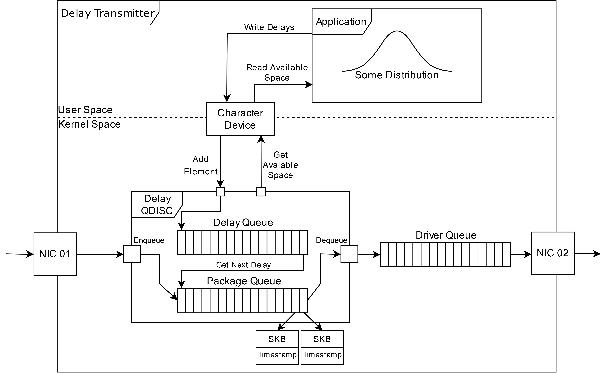
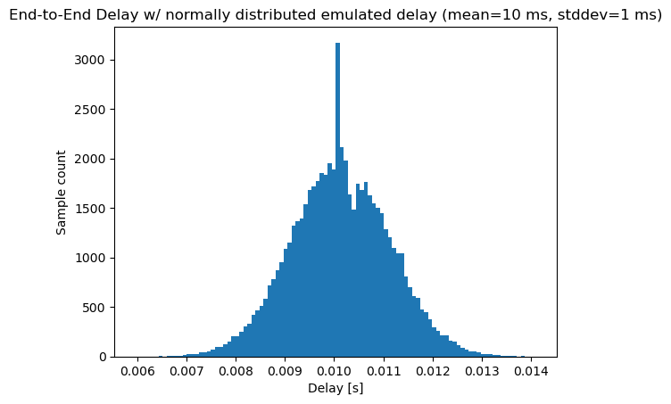
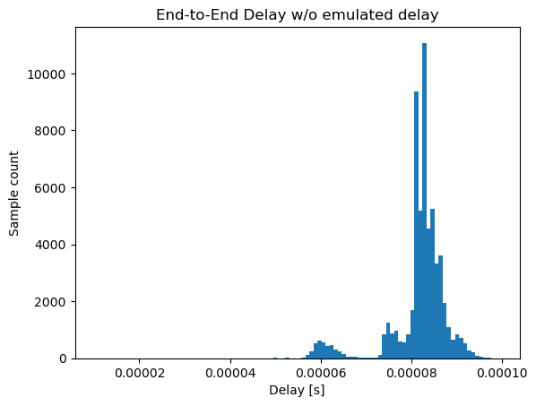

NetworkDelayEmulator implements a Linux Queuing Discipline (QDisc) for network delay emulation.

# Acknowledgments

NetworkDelayEmulator was originally developed by Lorenz Grohmann in his [Bachelor's thesis](https://elib.uni-stuttgart.de/handle/11682/14240) at University of Stuttgart in the context of the DETERMINISTIC6G project, which has received funding from the European Union's Horizon Europe research and innovation programme under grant agreement No. 101096504.

[DETERMINISTIC6G Project Website](https://deterministic6g.eu/).

DETERMINISTIC6G e-mail: coordinator@deterministic6g.eu

# License

GPL (TODO: Add license to project and each source code file.)

# Overview

The core of the emulator is a QDisc called sch_delay that can be assigned to network interfaces to add artificial delay to all packets leaving through this network interface. 

The following figure shows the system architecture consisting of two major parts: the QDisc running in the kernel space, and a user-space application providing individual delays for each transmitted packet through a character device. The provided delays are buffered in the QDisc, such that delay values are available immediatelly when new packets arrive. Whenever a packet is to be transmitted through the network interface, the next delay value is dequeued and applied to the packet before passing it on to the network interface (TX queue).

Providing delays through a user-space application allows for a flexible and convenient definition of delays without touching any kernel code. The project contains a sample user-space application implemented in Python to define delays as constant values or as normal distributions (probability density function), which can be easily extended to calculate other delay distribution.



The QDisc can also be applied to network interfaces that are assigned to a virtual bridge as described below to apply individual delay distributions to packets forwarded through different egress interfaces. This allows for emulating end-to-end network delay with a single Linux machine.

One limitation of this approach based on pre-calculating and buffering delays is that it is restricted to independent and identically distributed (i.i.d.) delays. If the delay of a specific packet depends on the delay of an earlier packet, this cannot be easily modelled by this approach since delays were already calculated and buffered possibly long before the packet to be delayed actually arrives. Also changing the delay distribution at runtime is not easily possible due to the buffering of delays from the old distribution. 

The project is structured as follows:

* Folder `sch_delay` containts the implementation of the QDisc.
* Folder `userspace_delay` contains the user-space application.
* Folder `tc` contains modifications to the tc tool required to load the QDisc. 

# Installation

## Prerequisites

The following instructions apply to Debian 12.5.0 with kernel 6.1.0-21-amd64. However, other Linux distributions should work too.

Install basic tools to build the kernel module and to execute the user-space app:

```console
$ sudo apt install bison flex build-essential python3 python3-numpy git
```

To compile the kernel module, the kernel header files matching the running kernel are required:

```console
$ sudo apt install linux-headers-$(uname -r)
```

Clone the repository (we assume that you cloned to your home directory and refer to this location as `~/networkdelayemulator` in the following):

```console
$ git clone https://deterministic6g.informatik.uni-stuttgart.de/d6g/networkdelayemulator.git
```

## Building and loading the kernel module

To build the kernel module:

```console
$ cd ~/networkdelayemulator/sch_delay
$ make clean & make
```

To load the kernel module:

```console
$ sudo insmod ~/networkdelayemulator/sch_delay/build/sch_delay.ko
```

Check, whether the module has been loaded:

```console
$ lsmod | grep sch_delay
sch_delay              16384  0
```

## Building modified tc tool

QDiscs are commonly loaded with the tc tool in Linux. The standard tc tool coming with the Linux distribution will not know about the new kernel module and QDisc. Therefore, we need to build our own patched version of tc that is aware of the delay QDisc as follows.

Download iproute2, which contains tc. We use iproute2 version v6.5.0, but you can also try other versions (see [iproute2](https://github.com/iproute2/iproute2/tags)):

```console
$ cd ~/networkdelayemulator/tc
$ git clone --branch v6.5.0 https://github.com/iproute2/iproute2.git
```

Patch the sources of tc:

```console
$ cp q_delay.c iproute2/tc
$ patch -R ./iproute2/tc/Makefile Makefile.patch
```

Build tc:

```console
$ cd iproute2
$ make
```

If everything worked well, you should see the tc executable in the directory `iproute/tc`. We refer to this patched version of tc as `~/networkdelayemulator/tc/iproute2/tc/tc` in the following.

# Usage: assigning a delay QDisc to a network interface and running the user-space application

If you have completed the steps above, you can assign a QDisc to a network interface, say eth0, as follows, using the modified tc tool:

```console
$ cd ~/networkdelayemulator/tc
$ sudo ./iproute2/tc/tc qdisc add dev eth0 root delay reorder True limit 1000
```

You can later remove the QDisc as follows:

```console
$ cd ~/networkdelayemulator/tc
$ sudo ./iproute2/tc/tc qdisc del dev eth0 root
```

The parameters of the QDisc are:

| Option | Type | Default | Explanation |
|--------|------|---------| ----------- |
| limit  | int  | 1000    | The size of the internal queue for buffering delayed packets. If this queue overflows, packets will get dropped. For instance, if packets are delayed by a constant value of 10 ms and arrive at a rate of 1000 pkt/s, then a queue of at least 1000 pkt/s * 10e-3 s = 10 pkts would be required. A warning will be posted to the kernel log if messages are dropped. |
| reorder| bool | true    | Whether packet reording is allowed to closely follow the given delay values, or keep packet order as received. If packet reordering is allowed, a packet with a smaller random delay might overtake an earlier packet with a larger random delay in the QDisc. If packet re-ordering is not allowed, additional delay might be added to the given delay values to avoid packet re-ordering. |

When you have assigned the QDisc, a new character device will appear in the directory `/dev/sch_delay`. Through this decvice, the QDisc receives the delays for the packets from a user-space application. A sample user-space application implemenented in Python is included in directory `userspace_delay`. This application supports constant delays and normally distributed delays. You can also take this application as an example to implement your own application providing delays to the QDisc. 

Start the given user-space application as follows:

```console
$ cd ~/networkdelayemulator/userspace_delay
$ sudo python3 userspace_delay.py /dev/sch_delay/eth0
```
Optional parameters to the user-space application are:

```
usage: userspace_delay.py [-h] [-i INTERVAL] [-m MINCOUNT] device

positional arguments:
  device                Character Device that corrosponds to the QDISC instance.

options:
  -h, --help            show this help message and exit
  -i INTERVAL, --interval INTERVAL
                        Interval in seconds in which to check free space inside the QDISC
  -m MINCOUNT, --mincount MINCOUNT
                        Minimum count of free elements in QDISC. New delays are only calculated and transmitted to the QDisc if the delay buffer has at least this number of free places. 
```

# Advanced usage: emulating end-to-end network delay for multiple end-to-end paths

Assume you want to emulate the individual end-to-end network delay in different directions (upstream and downstream to/from hosts) and/or between different pairs of hosts. To this end, you can use a virtual bridge on a central emulation node and assign individual delays to each outgoing (downstream) port.

The following figure shows a sample topology with two hosts H1, H2. The end-to-end delay of packets from H1 to H2 shall be different from the end-to-end delay from H2 to H1. Hemu is the host implementing network emulation to introduce the artificial delay between H1 and H2. A Linux virtual Bridge is used to forward packets from eth0 to eth1 depending on the destination. The two depicted QDiscs add the delay to egress packets. 

```
 ----      -------------------------------------      ----
|    |    |              ---------              |    |    |
|    |--->|------------>|         |<------------|<---|    |
| H1 |    | eth0        | vBridge |        eth1 |    | H2 |
|    |<---|<-QDisc------|         |------QDisc->|--->|    |
|    |    |              ---------              |    |    |
|    |    |                Hemu                 |    |    |
 ----      -------------------------------------      ----
```

To implement this scenario, we first create a virtual bridge on HEmu and assign the two physical network interfaces eth0 and eth1 to the virtual bridge. We also bring the interfaces up in case they were previously down:

```console
$ sudo ip link add name vbridge type bridge
$ sudo ip link set dev vbridge up
$ sudo ip link set eth0 master vbridge
$ sudo ip link set eth1 master vbridge
$ sudo ip link set eth0 up
$ sudo ip link set eth1 up
```

Next, we add the delay QDiscs to eth0 and eth1 on Hemu (be sure to load the kernel module first as explained above and use the modified tc tool that you built):

```console
$ cd ~/networkdelayemulator/tc
$ sudo ./iproute2/tc/tc  qdisc add dev eth0 root delay reorder True limit 1000
$ sudo ./iproute2/tc/tc  qdisc add dev eth1 root delay reorder True limit 1000
```

Finally, we start two instances of the user-space application, one providing delays for messages leaving through port eth0 (character device `/dev/sch_delay/eth0`) to emulate the delay from H2 towards H1, and one for port eth1 (character device `/dev/sch_delay/eth1`) to emulate the delay from H1 to H2.

```console
$ cd ~/networkdelayemulator/userspace_delay
$ sudo python3 userspace_delay.py /dev/sch_delay/eth0
$ sudo python3 userspace_delay.py /dev/sch_delay/eth1
```

# Evaluation

To give an impression on the accuracy to be expected with the NetworkDelayEmulator, we performed measurements with the following virtual bridge setup. We used network taps in fiber optic cables (marked with `x`) and an FPGA network measurement card from Napatech () to capture the traffic from H1 (sender) to H2 (receiver) with nano-second precision.

The sender app on H1 sends minimum-size UDP packets at a rate of 100 pkt/s to the receiver app on H2. 

The QDisc is configure with a normal distribution with mean = 10 ms and stddev = 1 ms.

As baseline, we also capture a trace with zero delay emulation (w/o QDisc on eth1). 

Traces were captured for about 10 min.

The specs of the Hemu host are:

* Intel(R) Xeon(R) CPU E5-1650 v3 @ 3.50GHz
* 16 GB RAM

```
       pcap (sender)
         ^
         |
 ----    |      -------------------------------------          ----
|    |   |    |              ---------              |        |    |
|    |---x--->|------------>|         |<------------|<-------|    |
| H1 |        | eth0        | vBridge |        eth1 |        | H2 |
|    |<-------|<------------|         |------QDisc->|---x--->|    |
|    |        |              ---------              |   |    |    |
|    |        |                Hemu                 |   |    |    |
 ----          -------------------------------------    |     ----
                                                        |
                                                        v
                                                       pcap (receiver)
```

The following figures show the histograms of the actual delay between the measurement points.





For the normal distribution, the following values were measured:

* mean = 0.010126313739089609 s
* stddev = 0.0009962691742813061 s
* 99 % confidence interval of the mean = [0.010115940597227065 s, 0.010136686880952152 s]
* min = 0.005947589874267578 s
* max = 0.014116764068603516 s

Without delay emulation, the end-to-end delay was:

* mean = 8.166161013459658e-05 s
* 99 % confidence interval of the mean = [8.159266669171887e-05 s, 8.173055357747428e-05 s]
* min = 1.0251998901367188e-05 s
* max = 9.942054748535156e-05 s

We see that the delay added without any emulated delay is around 81 us. This could be considered as an offset when creating delay distributions.