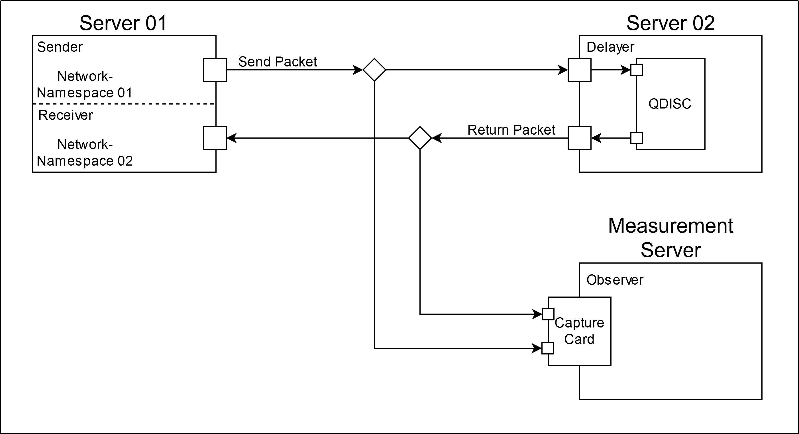

### Mesurement Scripts

These Scripts were used to measure delays with the following testing setup:
Note: These scripts were only designed for our testing setup and may possibly be changed for your use case.

* setup-ivs01.sh configures the Sender/Receiver
* setup-ivs02.sh configures the Delayer
* setup-ivs03.sh configures the Measurement Server

* capture-1.sh and capture-2.sh are used to capture packets on the Measurement Server
* convert.sh converts the measured data with tshartk and then calls calc_delta.py
* calc_delta.py converts the converted data into a csv of delays

* send-delay.py sends udp packages from the Sender to the Receiver
* receive-delay.py receives the packages from send-delay.py
* send.sh can start multiple instances of send-delay.py to achieve higher bandwidth.
* server-start.sh sets up a tmux session for the mesurement session.
